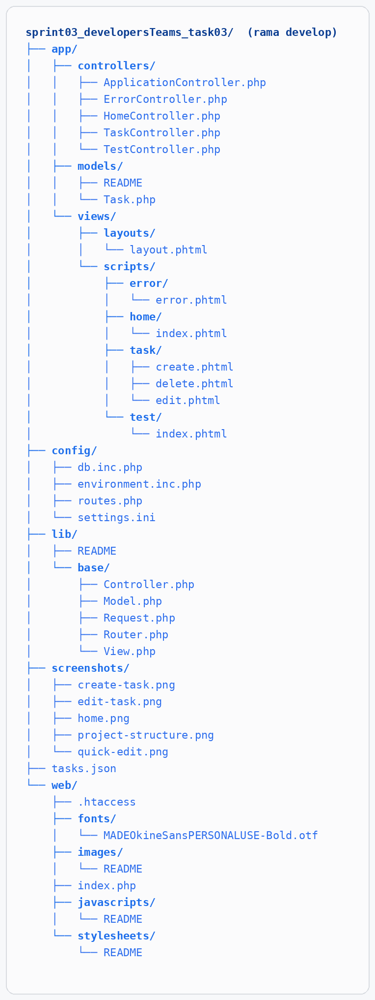
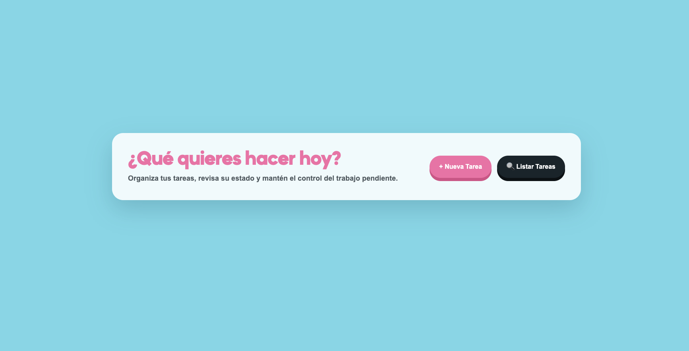
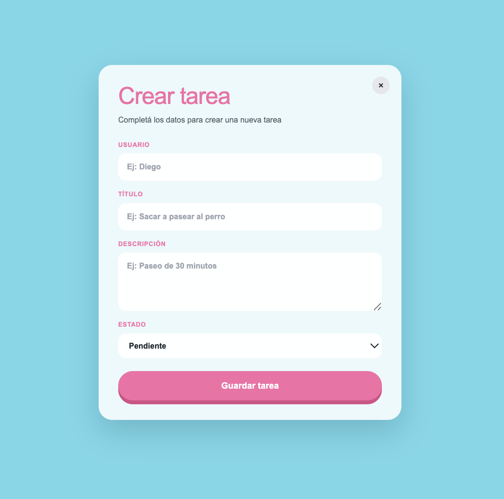
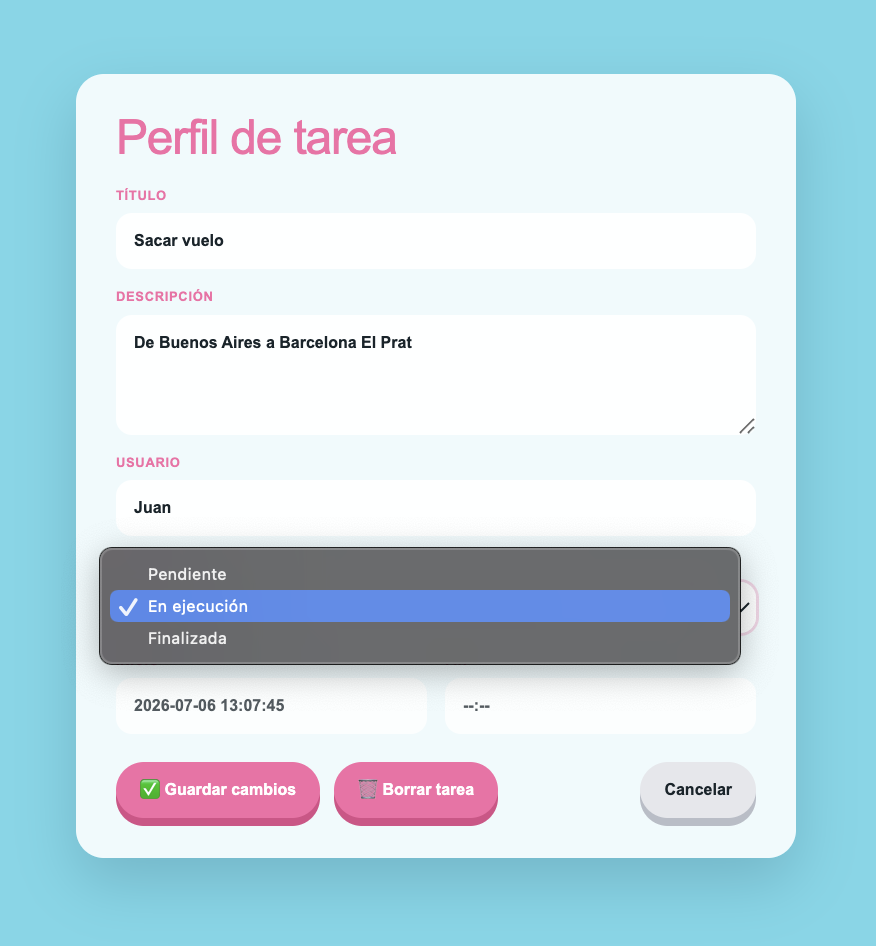
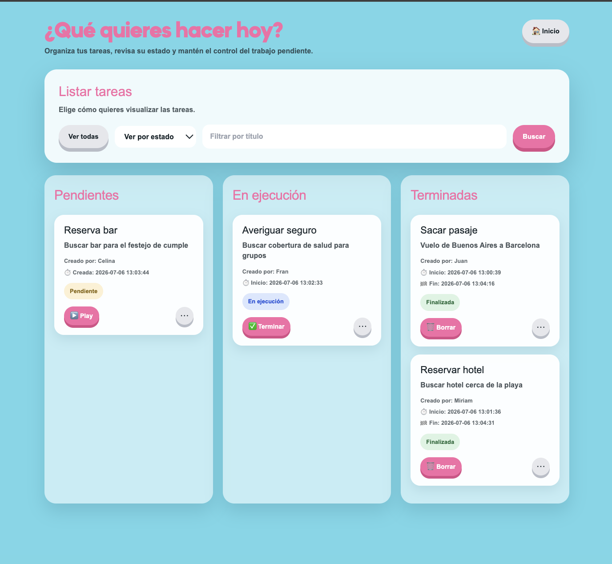

#  Task Manager

A web application for task management developed using **PHP** and the **MVC (Model-View-Controller)**architecture. The application allows users to create, view, edit, and delete tasks through a modern and responsive interface.

---

##  Features

-  Create tasks
-  View all tasks
-  Edit existing tasks
-  Delete tasks
-  Update task status
-  JSON-based data persistence
-  Responsive design
  
---

##  Technologies Used

### Backend

- PHP
- MVC Architecture
- JSON Storage

### Frontend

- HTML5
- Tailwind CSS
- JavaScript

### Development Tools

- Git
- GitHub
- IntelliJ IDEA

---

### Project Structure

---

##  Requirements

- PHP 8.0 or higher
- Git
- Node.js and npm (for Tailwind CSS)
- Modern web browser

---

##  Installation

### 1. Clone the repository

git clone https://github.com/your-username/your-repository.git

### 2. Navigate to the project directory

cd sprint03_developersTeams_task03

### 3. Install dependencies

npm install

### 4. Start the PHP development server

php -S localhost:8000 -t web

### 5. Open the application in your browser

text
http://localhost:8000

---

##  Tailwind CSS

This project uses **Tailwind CSS** to build a modern, responsive, and maintainable user interface.

To compile Tailwind during development:

bash
npm run dev

To generate a production build:

bash
npm run build

---

##  Task Management

### Create Task

Users can create a new task by providing:

- User name
- Title
- Description
- Status

### Available Statuses

- Pending
- In Progress
- Finished

### Task List

Displays all stored tasks with their relevant information.

### Edit Task

Allows users to modify existing task information.

### Delete Task

Removes tasks permanently from storage.

---

## Screenshots

### Home Page

### Create Task

### Edit Task

### Quick Edit

